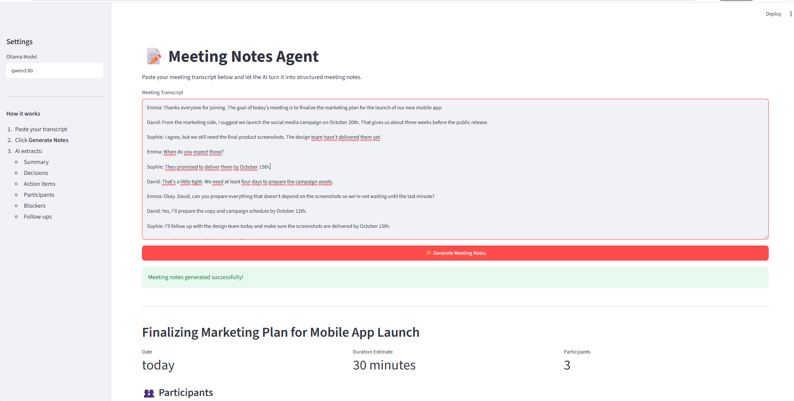
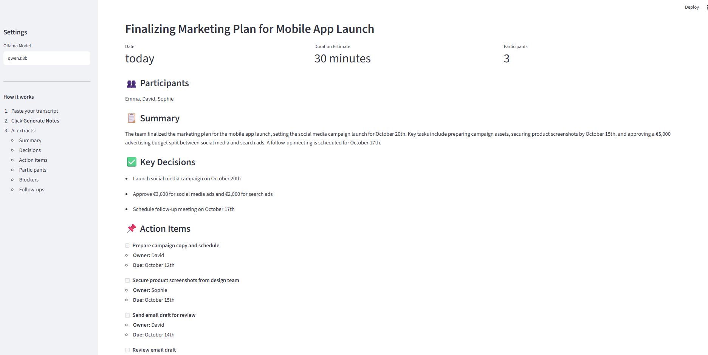
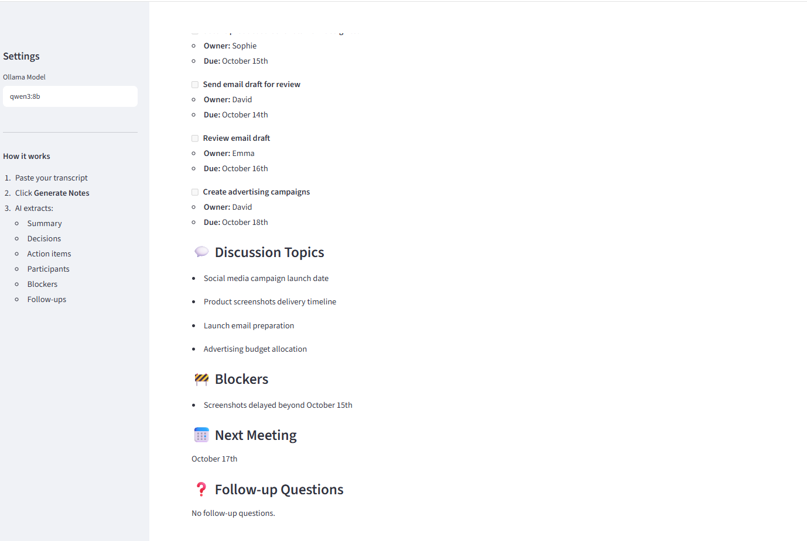

# 📝 Meeting Notes Agent

An AI-powered meeting notes generator built with **Streamlit**, **LangChain**, and **Ollama**.

Paste a meeting transcript into the app, and the AI automatically transforms it into structured, easy-to-read meeting notes including summaries, decisions, action items, participants, blockers, and follow-up questions.

## ✨ Features

* 🤖 AI-powered meeting transcript analysis
* 📋 Automatic executive summary generation
* 👥 Participant extraction
* ✅ Key decision identification
* 📌 Action item extraction with:

  * Task
  * Owner
  * Due date/timeframe
* 💬 Discussion topic extraction
* 🚧 Blocker identification
* 📅 Next meeting detection
* ❓ Follow-up question generation
* 📝 Markdown meeting notes formatting
* ⬇️ Download generated notes as a `.md` file
* ⚙️ Selectable Ollama model from the Streamlit sidebar
* 🔒 Runs locally with Ollama

## 🖥️ Demo

The application provides a simple interface:

1. Paste your meeting transcript.
2. Select your preferred Ollama model.
3. Click **Generate Meeting Notes**.
4. Review the structured results.
5. Download the notes as a Markdown file.

## 🏗️ Architecture

```text
                ┌─────────────────────┐
                │   Meeting Transcript │
                └──────────┬──────────┘
                           │
                           ▼
                ┌─────────────────────┐
                │     Streamlit UI    │
                └──────────┬──────────┘
                           │
                           ▼
                ┌─────────────────────┐
                │   LangChain         │
                │   ChatOllama        │
                └──────────┬──────────┘
                           │
                           ▼
                ┌─────────────────────┐
                │    Ollama / LLM     │
                │      qwen3:8b       │
                └──────────┬──────────┘
                           │
                           ▼
                ┌─────────────────────┐
                │     JSON Output     │
                └──────────┬──────────┘
                           │
                           ▼
                ┌─────────────────────┐
                │ Structured Notes    │
                │ + Markdown Download │
                └─────────────────────┘
```

## 📦 Tech Stack

* **Python**
* **Streamlit** — Web application interface
* **LangChain** — LLM integration
* **Ollama** — Local LLM inference
* **Qwen3 8B** — Default language model
* **python-dotenv** — Environment configuration

## 🚀 Getting Started

### 1. Clone the repository

```bash
git clone https://github.com/YOUR_USERNAME/YOUR_REPOSITORY.git
cd YOUR_REPOSITORY
```

### 2. Create a virtual environment

#### Windows

```bash
python -m venv .venv
.venv\Scripts\activate
```

#### macOS / Linux

```bash
python3 -m venv .venv
source .venv/bin/activate
```

### 3. Install dependencies

Create a `requirements.txt` file containing:

```txt
streamlit
langchain-core
langchain-ollama
python-dotenv
```

Then install them:

```bash
pip install -r requirements.txt
```

### 4. Install Ollama

Install Ollama for your operating system and make sure the Ollama service is running.

Then download the default model:

```bash
ollama pull qwen3:8b
```

You can use another Ollama-compatible model by changing the model name in the application's sidebar.

### 5. Run the application

```bash
streamlit run app.py
```

The application will open in your browser.


## 📁 Project Structure

```text
meeting-notes-agent/
│
├── app.py
├── requirements.txt
├── .env
├── .gitignore
└── README.md
```

## 📸 Screenshots

### 🏠 Meeting Transcript Input



### 🤖 Generated Meeting Notes




⭐ If you find this project useful, consider giving the repository a star!
